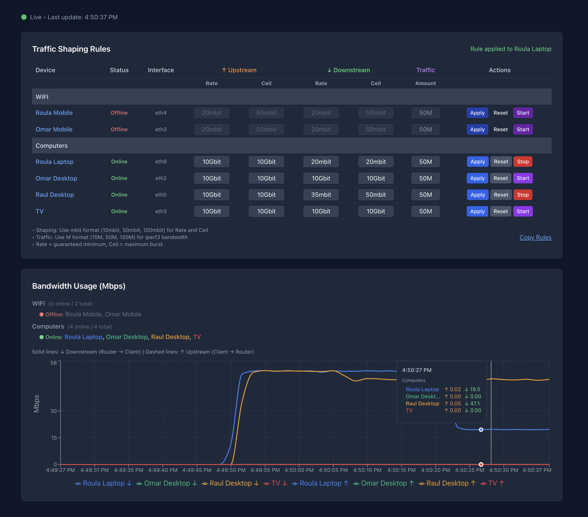

# QC - Network Traffic Shaping Playground

A Docker-based network traffic shaping playground with dynamic cluster and device management. Provides real-time bandwidth monitoring, traffic shaping controls, and an intuitive web interface for managing Quality of Service (QoS) across multiple network clusters. Allows you to easily experiment with network traffic shaping via docker containers without having to spin up numerous virtual machines.



## Features

- **Multi-Cluster Architecture** - Organize devices into logical clusters with independent network isolation
- **Cluster/Device Management** - Create and manage clusters and devices
- **Real-Time Monitoring** - Live bandwidth charts with upstream/downstream metrics for all active devices
- **Traffic Shaping Controls** - Apply bandwidth limits (rate/ceil) via HTB qdisc on a per-device basis
- **Traffic Generation** - Built-in iperf3 integration for bandwidth testing
- **Visual Sync Feedback** - Unsynced devices highlighted, hover-to-delete functionality

## Architecture

```
┌─────────────────────────────────────────────────┐
│              Frontend (Port 3000)               │
│  - Dashboard                                    │
│    • Container Status Monitor                   │
│    • Integrated Cluster/Device Management       │
│    • Traffic Shaping Rules (inline editing)     │
│    • Real-time Bandwidth Charts                 │
└────────────────┬────────────────────────────────┘
                 │
┌────────────────▼────────────────────────────────┐
│              Backend (Port 8000)                │
│  - Cluster/Device Management API                │
│  - Container Status Monitoring                  │
│  - Traffic Control API (tc commands)            │
│  - Metrics Collection & SSE Streaming           │
│  - Sync Service (Docker orchestration)          │
└────────────────┬────────────────────────────────┘
                 │ Docker SDK
┌────────────────▼────────────────────────────────┐
│             Docker Infrastructure               │
│  Router: Traffic shaping + iperf3 servers       │
│  Devices: Per-device containers on isolated     │
│           networks (10.X.0.0/24 subnets)        │
└─────────────────────────────────────────────────┘
```

## Quick Start

### 1. Build and Start All Services

```bash
docker compose build
docker compose up -d
```

This starts:
- **Router** - Traffic shaping with HTB qdisc and iperf3 servers
- **InfluxDB** - Time-series metrics storage
- **Backend** - Server at `http://localhost:8000`
- **Frontend** - UI at `http://localhost:3000`

### 2. Create Your First Cluster

1. Open the web UI at `http://localhost:3000`
2. In the "Traffic Shaping Rules" section, click "+ Add Cluster" (top right)
3. Enter a cluster name and optional description, then click "Save"
4. Click "+ Device" next to your cluster name to add devices
5. Enter device name and select type (PC, Mobile, Server, IoT), then click "Save"
6. Click "Sync" next to the cluster name to provision containers and networks
7. Once synced, devices will show as "Online" and be ready for traffic shaping

## Usage

### Dashboard Overview

- **Container Status Monitor** (top right) - Real-time status of Frontend, Backend, Router, and running Clients
- **Integrated Cluster/Device Management** - Inline editing within the Traffic Shaping Rules table
- **Traffic Shaping Controls** - Apply bandwidth limits directly on each device row
- **Real-time Bandwidth Charts** - Live metrics for all online devices

### Cluster & Device Management

**Create a Cluster:**
- Click "+ Add Cluster" button (top right of Traffic Shaping Rules section)
- Enter cluster name and optional description
- Click "Save" to create
- The cluster row appears in the table

**Add Devices to Cluster:**
- Click "+ Device" next to the cluster name
- Enter device name and select type (PC, Mobile, Server, IoT)
- Click "Save" to create
- Device row appears with amber background (unsynced state)

**Sync Cluster:**
- Click "Sync" button next to cluster name when changes are pending
- Reconciles database state with Docker infrastructure
- Creates missing containers/networks
- Destroys orphaned containers
- Starts iperf3 servers for new devices
- Devices transition to "Online" status when ready

**Delete Cluster/Device:**
- Hover over cluster or device name to reveal trash icon
- Click trash icon to delete (confirmation required)
- Deleting a cluster removes all its devices

### Traffic Shaping

**Apply Bandwidth Limits:**
1. Ensure devices are "Online" (synced and running containers)
2. For each device row, enter rate and ceil values for upstream/downstream:
   - **Rate**: Guaranteed minimum bandwidth (e.g., `20mbit`)
   - **Ceil**: Maximum burst bandwidth (e.g., `50mbit`)
3. Click "Apply" to configure HTB classes on router
4. Controls are disabled until device is online and synced

**Reset to Unlimited:**
- Click "Reset" button to remove limits (defaults to 1Gbit)

**Traffic Generation:**
- Enter traffic amount in the "Traffic" column (e.g., `50M` for 50 Mbps)
- Click "Start" to begin iperf3 traffic test
- Click "Stop" to terminate traffic (button shows current state)

**Bulk Operations:**
- Click "Kill All Containers" (top right) to emergency stop all client containers
- Click "Copy Rules" to copy all active tc commands to clipboard

### Real-Time Monitoring

The Dashboard displays:
- **Container Status Monitor** - Live status indicators for infrastructure and client containers
- **Bandwidth Chart** - Live upstream/downstream metrics for all online devices
- **Device Status** - Visual indicators (Online/Starting/Stopping/Offline/Error) for each device
- **Cluster Organization** - Devices grouped by cluster with expandable rows
- **Sync Status** - Unsynced devices highlighted with amber background
- **Historical Data** - Last 60 data points (1-minute window at 1Hz)

## Network Topology

Each device gets:
- **Isolated Docker Network** - Subnet `10.X.0.0/24` (X = unique octet)
- **Static IP Address** - Device at `10.X.0.10`, Router at `10.X.0.254`
- **Dedicated Router Interface** - `ethN` for device, `ifbN` for upstream shaping

Example with 2 clusters:
```
Router (10.x.0.254 on each network)
  ├── Cluster: Desktops
  │     ├── Desktop 1 (10.1.0.10 → eth1/ifb1)
  │     └── Desktop 2 (10.2.0.10 → eth2/ifb2)
  └── Cluster: Mobile Devices
        ├── Phone 1 (10.3.0.10 → eth3/ifb3)
        └── Tablet 1 (10.4.0.10 → eth4/ifb4)
```

## Traffic Control Details

### HTB (Hierarchical Token Bucket) Configuration

Each device interface has HTB classes configured:
- **Root Qdisc**: `htb 1:` on physical interface (downstream)
- **Root Qdisc**: `htb 2:` on IFB device (upstream)
- **Parent Class**: `1:1` (downstream) or `2:1` (upstream) - 1Gbit ceiling
- **Device Class**: `1:30` (downstream) or `2:30` (upstream) - configurable rate/ceil

### Apply Traffic Shaping

The API translates UI inputs into `tc` commands:

**Downstream (Router → Device):**
```bash
tc class change dev eth1 parent 1:1 classid 1:30 htb rate 20mbit ceil 50mbit
```

**Upstream (Device → Router):**
```bash
tc class change dev ifb1 parent 2:1 classid 2:30 htb rate 10mbit ceil 30mbit
```

### Check Statistics

```bash
# View downstream stats
docker exec router tc -s class show dev eth1

# View upstream stats
docker exec router tc -s class show dev ifb1

# List all qdiscs
docker exec router tc qdisc show
```


## Troubleshooting

### Check Infrastructure Status

The Container Status Monitor (top right of dashboard) shows real-time status:
- **Green dots** indicate containers are running
- **Red dots** indicate containers are offline
- Check Frontend, Backend, Router, and Client count at a glance

### Containers not creating
```bash
# Check Docker is running
docker ps

# Check router container
docker logs router

# Restart router
docker restart router

# Check container status via API
curl http://localhost:8000/api/containers/status
```

### Devices stuck in "Starting" status
```bash
# Check sync logs in backend terminal
# Manually inspect container
docker ps -a | grep qc_
docker logs <container_name>
```

### Traffic shaping not applying
```bash
# Verify device is online and has interface assigned
# Check tc configuration on router
docker exec router tc -s class show dev eth1

# Verify HTB qdiscs exist
docker exec router tc qdisc show
```

### No bandwidth metrics showing
```bash
# Check iperf3 servers are running on router
docker exec router ps aux | grep iperf3

# Check SSE stream
curl http://localhost:8000/api/metrics/stream

# Verify frontend is polling metrics
# Check browser console for errors
```

### Network conflicts (subnet already in use)
```bash
# List all Docker networks
docker network ls

# Remove orphaned networks
docker network rm <network_name>

# Prune unused networks
docker network prune
```

## Technology Stack

**Frontend:**
- React 18 + TypeScript
- Vite (build tool)
- Recharts (bandwidth visualization)
- Tailwind CSS (styling)
- Axios (HTTP client)

**Backend:**
- FastAPI (REST API framework)
- SQLAlchemy (ORM)
- Pydantic (data validation)
- Docker SDK for Python (container orchestration)
- Server-Sent Events (real-time streaming)

**Infrastructure:**
- Docker & Docker Compose
- Alpine Linux (router container)
- Ubuntu (device containers)
- Linux Traffic Control (tc with HTB)
- iperf3 (bandwidth testing)
- IFB devices (upstream shaping)

## Default Bandwidth Values

- **No limit**: Empty inputs default to `1gbit` (effectively unlimited)
- **Rate**: Guaranteed minimum bandwidth
- **Ceil**: Maximum burst allowed (must be ≥ rate)

Format: Use `mbit` for traffic shaping (e.g., `10mbit`, `50mbit`, `100mbit`)

## License

This is a learning project for network traffic shaping and QoS experimentation.
